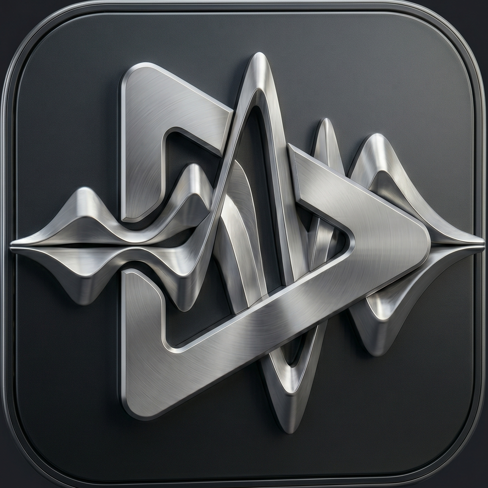
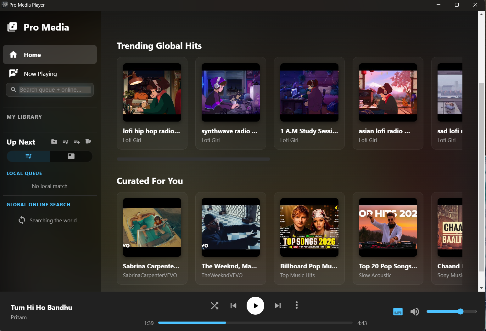
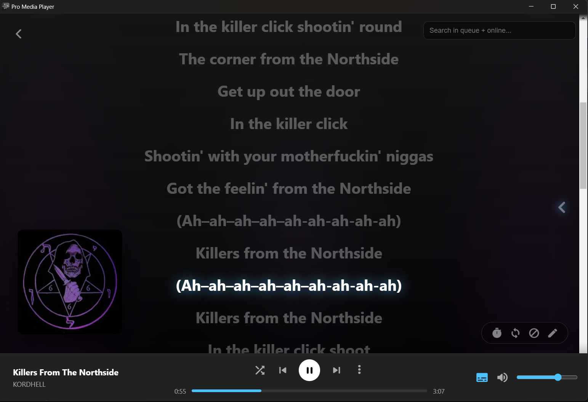
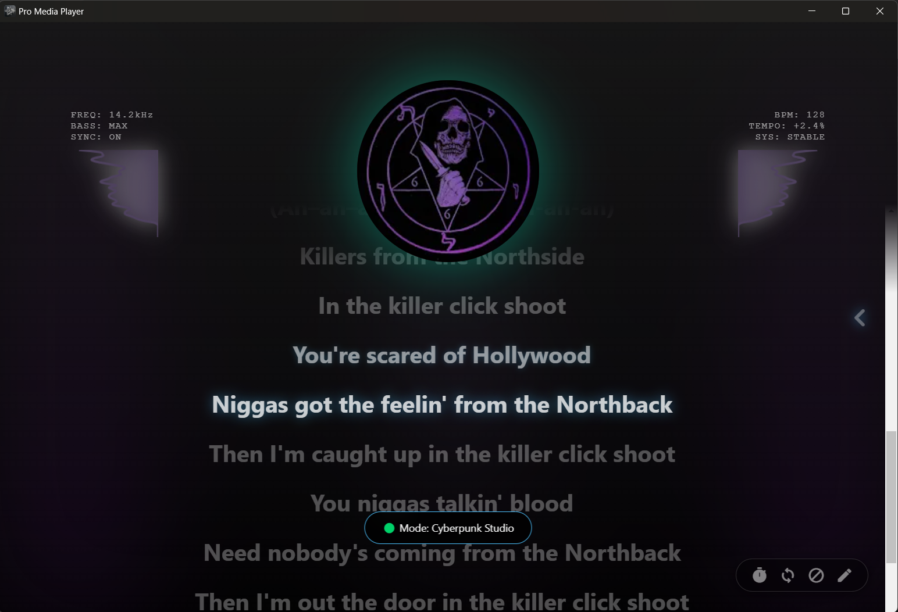
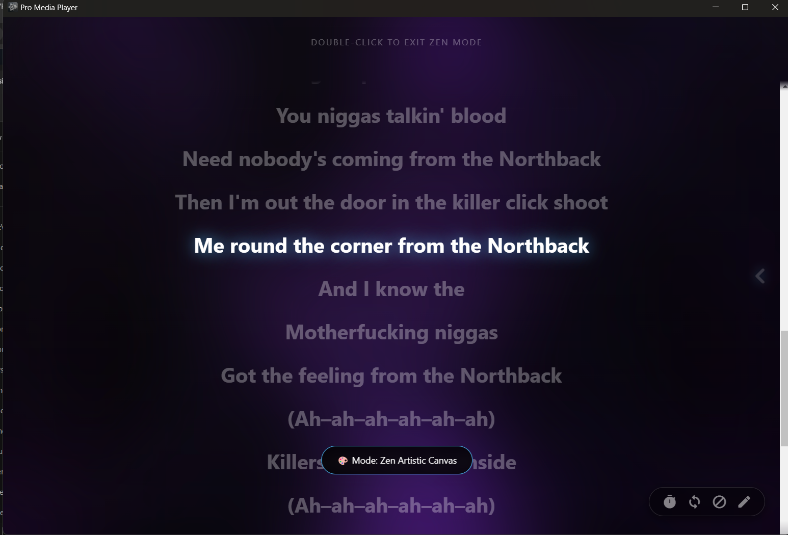
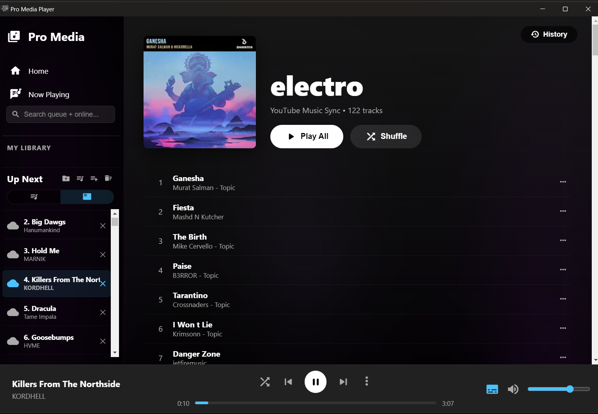

#  Pro Media Player


A premium, lightweight desktop music player designed for high-quality local listening with **AI-Powered Synced Lyrics** and **Immersive Visuals**.

---

### 🌟 Overview
Most modern players are either too heavy, hide synced lyrics behind a subscription, or completely fail when a song isn't in their database. This player focuses on:
* **Privacy & Speed**: It plays your local `.mp3` files without tracking your data.
* **Smart Syncing**: Fetches perfect lyrics from the LRCLIB database, and uses Local AI to automatically sync plain text when timed lyrics don't exist.
* **Immersive Vibe**: A dedicated full-screen mode that blurs your album art for a cinematic background, complete with auto-fading UI for a distraction-free experience.

---

### 🚀 How to Run

#### **Option 1: Standalone Installer (Recommended)**
1.  Navigate to the GitHub Releases folder.
2.  Download **`Music Player Mass Setup 2.0.0.exe`**.
3.  Run the installer to add the player to your Start Menu and Desktop.

#### **Option 2: Run from Source (For Developers)**
1.  **Clone the repository**:
    ```powershell
    git clone [https://github.com/mahitmass/music_with_LYRICS-PREMIUM.git](https://github.com/mahitmass/music_with_LYRICS-PREMIUM.git)
    cd music_with_LYRICS
    ```
2.  **Install Dependencies**:
    ```powershell
    npm install
    ```
3.  **Launch the App**:
    ```powershell
    npm start
    ```

---

### ｲ App Showcase
| Normal Boot (Explore) | Immersive Mode (Classic) | Cyberpunk Studio | Zen Artistic Canvas | Playlist Sync |
| :---: | :---: | :---: | :---: | :---: |
|  |  |  |  |  |

---

###  AI & Smart Sync Features
* **Interactive Tour**: Click the **Keyboard Shortcuts** menu and use the `?` tooltips to take a live, interactive spotlight tour of every feature in the app.
* **Background AI Queue**: Queue up multiple plain-text songs for AI synchronization. The app processes them sequentially in the background without freezing your music.
* **"Rubber Band" Interpolation**: Custom AI logic that anchors known words and mathematically stretches the timestamps in between, making it impossible for fast songs to drift out of sync.
* **Smart Duration Sorting**: Automatically compares local file duration to database results to ensure the most accurate lyric match.
* **Fallback Generator**: If the database is empty, force the AI to transcribe lyrics from scratch directly from the **Retry** menu.

---

### 🎧 Key Player Features
* **Cinematic Idle Fade**: If left idle for 5 minutes, UI elements fade out for a distraction-free "Screenshot Mode."
* **Precision Auto-Scroller**: Automatically snaps the playing song to the center of your queue.
* **Advanced Manual Sync**: Dial in timing perfectly. Hold `+` / `-` to shift, or type an exact offset (e.g., `-2.5s`).
* **Smart Drag & Drop**: Drag entire folders from Windows Explorer directly into the queue.
* **Interactive Lyrics**: Click any lyric line to jump the song to that exact timestamp.
* **Persistent Memory**: Remembers your queue, last played track, and custom sync offsets for every individual song.

---

### 🛠 Technical Stack
* **Framework:** Electron.js (Node.js & Chromium)
* **Frontend:** Vanilla JavaScript, HTML5, CSS3
* **Audio:** HTML5 Audio API & Web Audio API
* **Metadata:** `jsmediatags` (Extracts embedded Album Art & Tags)
* **Lyrics API:** LRCLIB (Open-source lyrics database)
* **AI:** `whisper-node` & `ffmpeg-static` for local transcription
